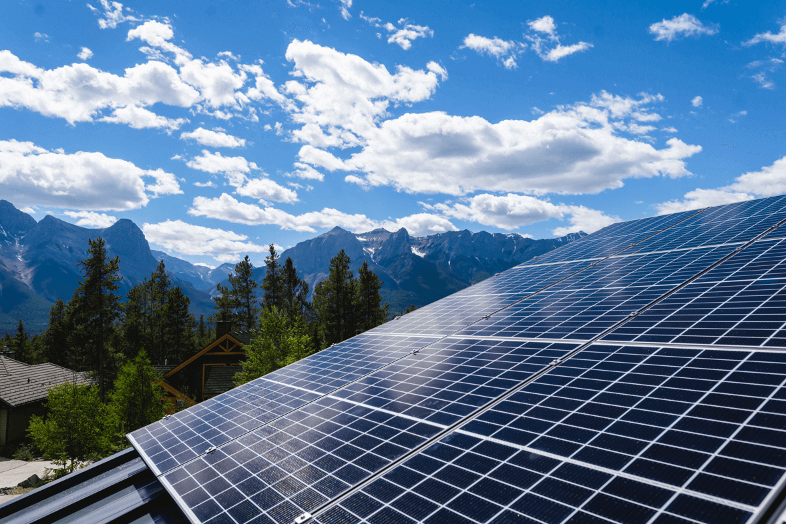
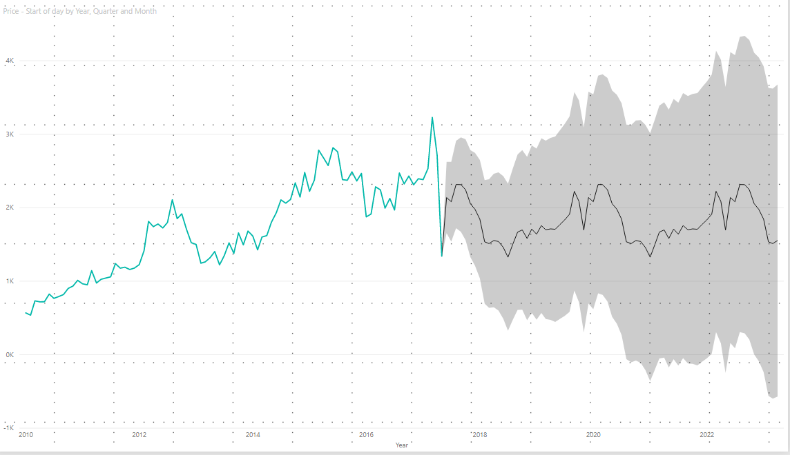
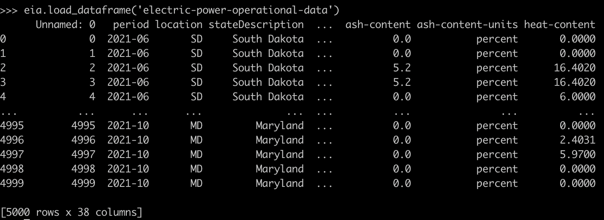
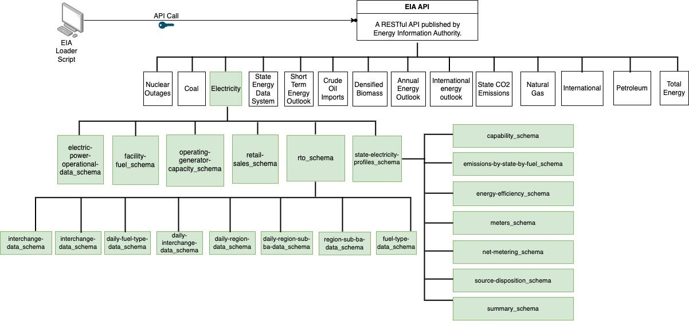
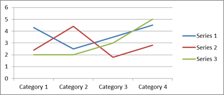
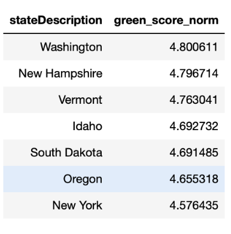
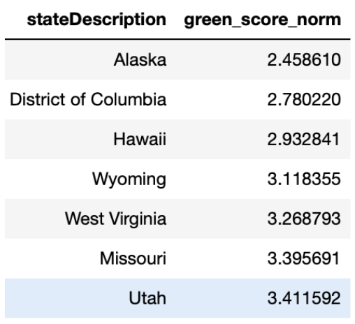
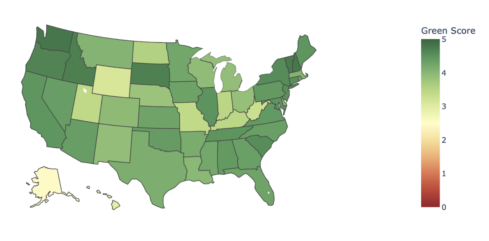
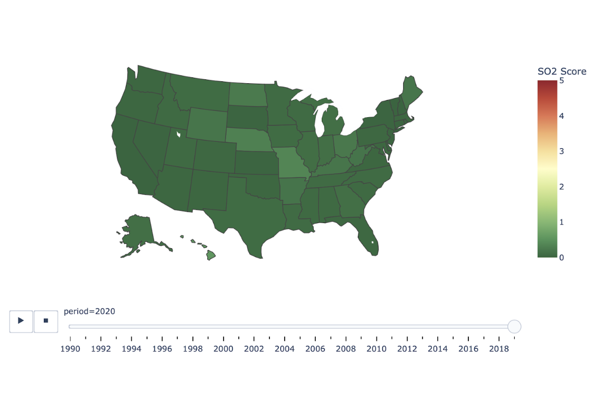

<style scoped>
h2, p {
  background-color: rgba(255, 255, 255, 0.9);
}
</style>

## EIA Py

Analysis and forecasting of Electricity Information Administration Electricity Demand Data

---

## Project Links

- [GitHub Repo](https://github.com/lukewood/eia-py)
- [API Docs](https://lukewood.github.io/eia-py)
- [Slides](https://lukewood.github.io/eia-py/slides)
- [Data Understanding Dashboard](https://lukewood.github.io/eia-py/dashboard/)

---

## Objectives

---

## Publish `eia-py`

- publish a high quality PyPi package
- allow others to scrape and use the Energy Information Administration data
- efficiently cache data to minimize downloads

---

## Energy Information Administration data analysis

- How electric energy is being consumed around the States?
- What are the sources contributing to its generation?
- What impact do the sources have on the environment?

---

## Forecast electricity demand



---

## Using the Python Package

---

```bash
pip install eia-py-api
```

---

```python
import eia
dataframe = eia.load_dataframe()
# Scrapes, caches, and loads all data into a `pd.DataFrame`.
# Reuses cached data to avoid excessive redownloads
```

---



---

More information available in [the GitHub repo README](https://github.com/lukewood/eia-py)


---



<!--
- The energy information authority exposes all the data it collects via an API. To access this API we need to request for a key.
- This process is fairly straightforward and you can obtain it from https://www.eia.gov/opendata/index.php.
- The API Docs are available at https://www.eia.gov/opendata/documentation.php.
- The Structure of the API is shown in the figure on this slide.
- We have designed a script that fetches the Electricity data from the API and structures the data as a data frame.
- This can be loaded using the eia.loaders.load_dataframe() method by passing in the table that we would like to analyse.
- There are a total of 19 tables under the electricity category. We have tried to obtain some meaningful insights from these tables in this project.
-->

---

# Data Anaysis



---

# Green Score

- Scalar between 0 (Poor) and 5 (Best)
- Measures the environmental impact of electricity generation
- Primarily takes NOx and CO2 into account
- scales NOx to CO2 equivalent
-  normalises the value to per unit of electricity generation

---

# Best 7 States



---

# Worst 7 States



---

# Green Score Over Time


# TODO ADD PLOT LINK
[Link to the live plot on the dashboard]()

---


# Trend!

_The Green Score has been improving over the years!_

- Decision makers are pushing towards more greener sources of energy
- This essentially could be due to improved power generation techniques

---

"Good Job Everyone!!!"


---

# ...

---


---

# Except Texas


---


---

"Good Job Texas!!!"


---

# SO2 Score

- SO2 is a secondary pollutant
- Separated for the primary score
- Scalar between 0 (Best) and 5 (Poor)
- SO2 emission during electricity generation.
- Again is normalised per unit of electricity generation

---


# Best 7 States


---

# Worst 7 States


---

# Green Score Over Time


# TODO ADD PLOT LINK
[Link to the live plot on the dashboard]()

---

## Trend

_The SO2 score has been getting better over the years._

 This could be due to using fuel sources with lower Sulphur content.
