<style scoped>
h2, p {
  background-color: rgba(255, 255, 255, 0.9);
}
</style>

## EIA Py

Analysis and forecasting of Electricity Information Administration Electricity Demand Data

---

## Project Links

- [GitHub Repo](https://github.com/lukewood/eia-py)
- [API Docs](https://lukewood.github.io/eia-py)
- [Slides](https://lukewood.github.io/eia-py/slides)
- [Data Understanding Dashboard](https://lukewood.github.io/eia-py/dashboard/)

---

## Objectives

---

## Publish `eia-py`

- publish a high quality PyPi package
- allow others to scrape and use the Energy Information Administration data
- efficiently cache data to minimize downloads

---

## Energy Information Administration data analysis

- How electric energy is being consumed around the States?
- What are the sources contributing to its generation?
- What impact do the sources have on the environment?

---

## Forecast electricity demand


---

## Using the Python Package

---

```bash
pip install eia-py-api
```

---

```python
import eia
dataframe = eia.load_dataframe()
# Scrapes, caches, and loads all data into a `pd.DataFrame`.
# Reuses cached data to avoid excessive redownloads
```

---


---

More information available in [the GitHub repo README](https://github.com/lukewood/eia-py)

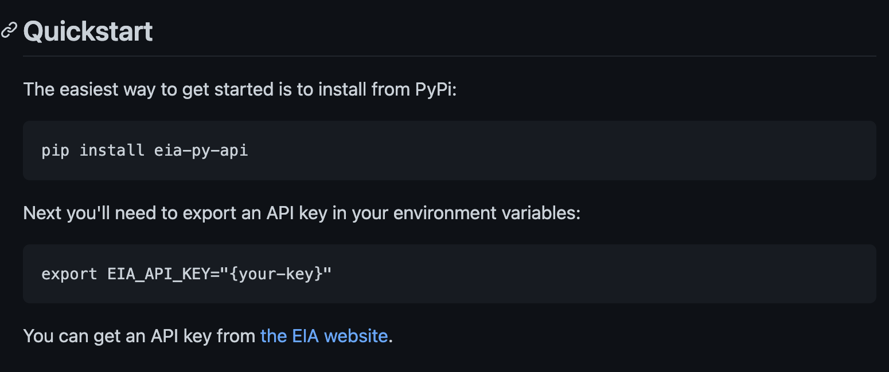

---

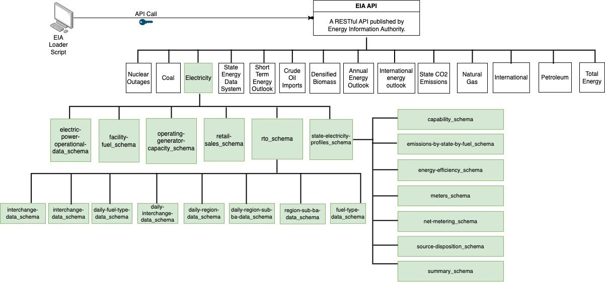

<!--
- The energy information authority exposes all the data it collects via an API. To access this API we need to request for a key.
- This process is fairly straightforward and you can obtain it from https://www.eia.gov/opendata/index.php.
- The API Docs are available at https://www.eia.gov/opendata/documentation.php.
- The Structure of the API is shown in the figure on this slide.
- We have designed a script that fetches the Electricity data from the API and structures the data as a data frame.
- This can be loaded using the eia.loaders.load_dataframe() method by passing in the table that we would like to analyse.
- There are a total of 19 tables under the electricity category. We have tried to obtain some meaningful insights from these tables in this project.
-->

---

# Data Anaysis

---

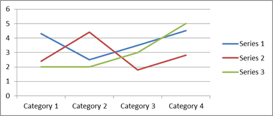

---

# Green Score

- Scalar between 0 (Poor) and 5 (Best)
- Measures the environmental impact of electricity generation
- Primarily takes NOx and CO2 into account
- scales NOx to CO2 equivalent
-  normalises the value to per unit of electricity generation

---

## Best 7 States


---

## Worst 7 States

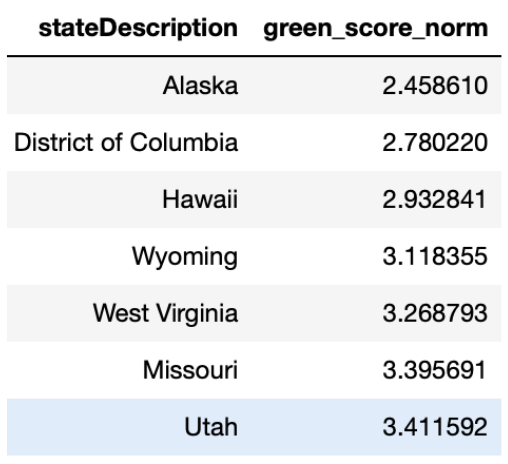

---

## Green Score Over Time
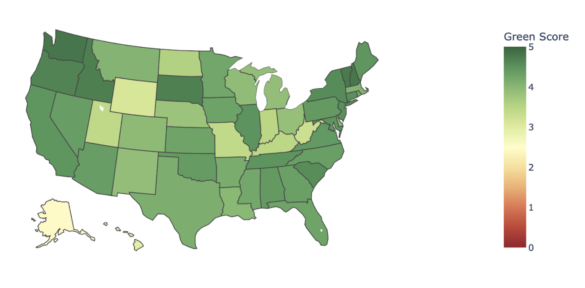

[Link to the live plot on the dashboard](https://lukewood.github.io/eia-py/dashboard/Green_Score_Map.html)

---

# Trend!

_The Green Score has been improving over the years!_

- Decision makers are pushing towards more greener sources of energy
- This essentially could be due to improved power generation techniques

---

"Good Job Everyone!!!"


---

# ...

---

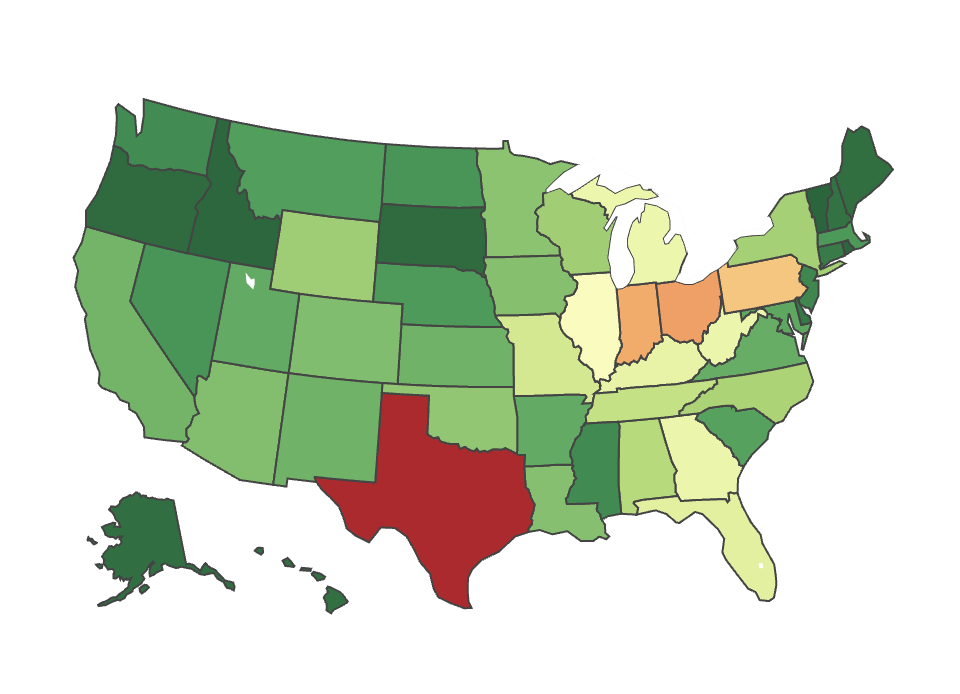

---

# Except Texas


---

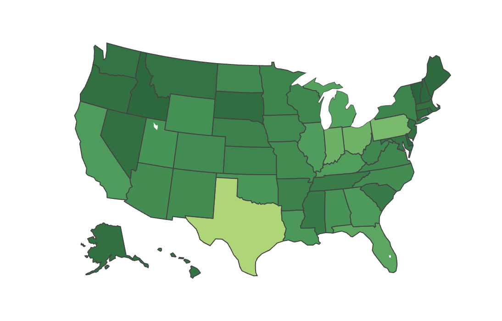

---

"Good Job Texas!!!"


---

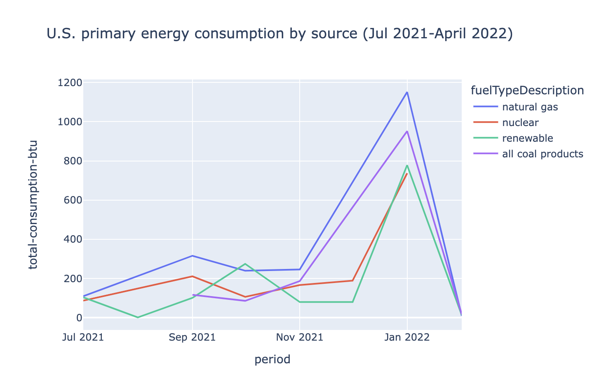

[Live Plot](https://lukewood.github.io/eia-py/dashboard/energy_consumption_by_source.html)

---

# SO2 Score

- SO2 is a secondary pollutant
- Separated for the primary score
- Scalar between 0 (Best) and 5 (Poor)
- SO2 emission during electricity generation.
- Again is normalised per unit of electricity generation

---

## Best 7 States

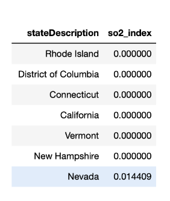

---

## Worst 7 States

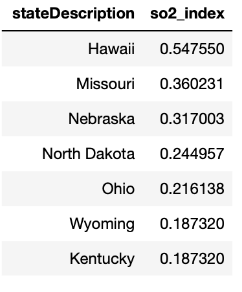

---

### SO2 Score Over Time
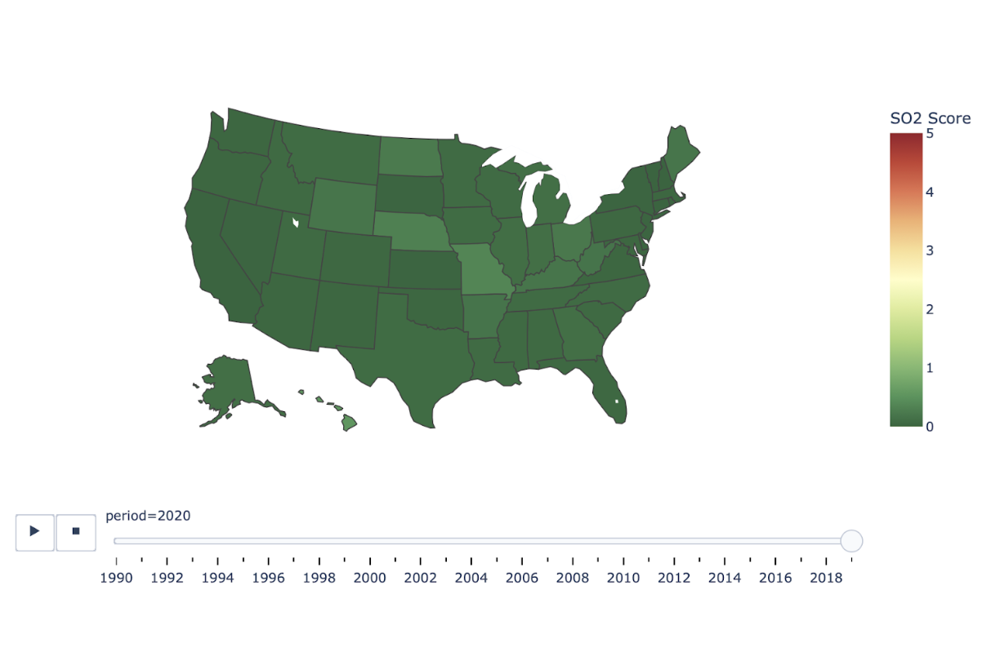

[Link to the live plot on the dashboard](https://lukewood.github.io/eia-py/dashboard/SO2_Score_Map.html)

---

## Trend

_The SO2 score has been getting better over the years._

 This could be due to using fuel sources with lower Sulphur content.

---

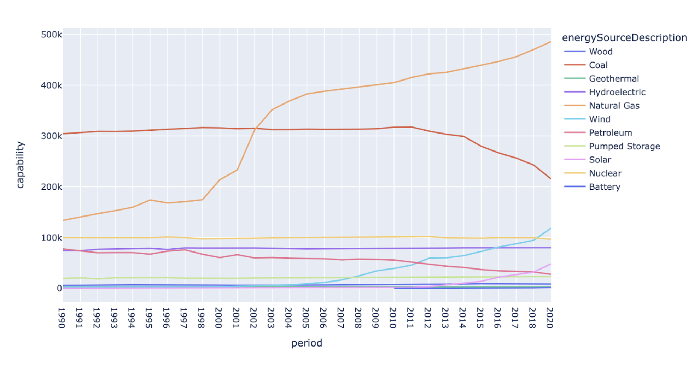

<!--

- This plot shows the electricity generated from some of the major sources such as Coal, Natural Gas, Wind, etc

- Trend: The amount of coal used in electricity generation has been steadily decreasing since 2010.

- Natural Gas has been increasing and so are renewable sources such as wind, solar, etc.

- This is probably one of the reasons why the green score and SO2 scores have been improving over the years.

-->

---

### Self Sufficiency Index

- a measure of energy independence of each state
- index of around 1 indicates that a statecould be self sufficient
- many states fall under this category

<!--
This plot shows the self sufficiency index which is a measure of energy independence of each state. A self sufficiency index of around 1 indicates that a state consumes what it produces and could be self sufficient. Many states fall under this category.
-->

---

## Best 7 States

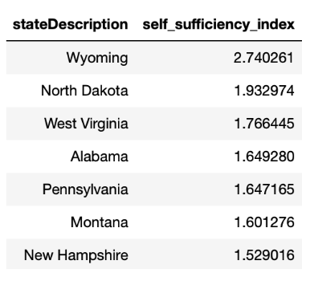

---

## Worst 7 States

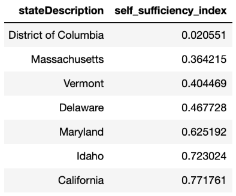

---

### Self Sufficiency Index Over Time
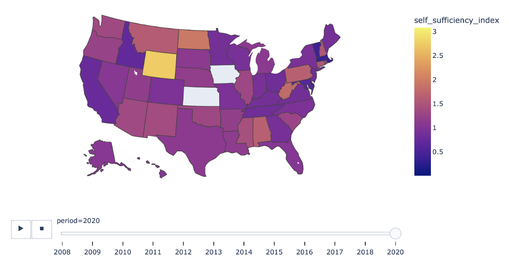

[Link to the live plot on the dashboard](https://lukewood.github.io/eia-py/dashboard/Self_Sufficiency_Index.html)

<!--

- This plot shows the self sufficiency index which is a measure of energy independence of each state.

- Trend: A self sufficiency index of around 1 indicates that a state consumes what it produces and could be self sufficient.

- Many states fall under this category.

-->

---

# Forecasting

---

US natural gas consumption Forecast by sector (Jan 2014-Nov 2022)

---

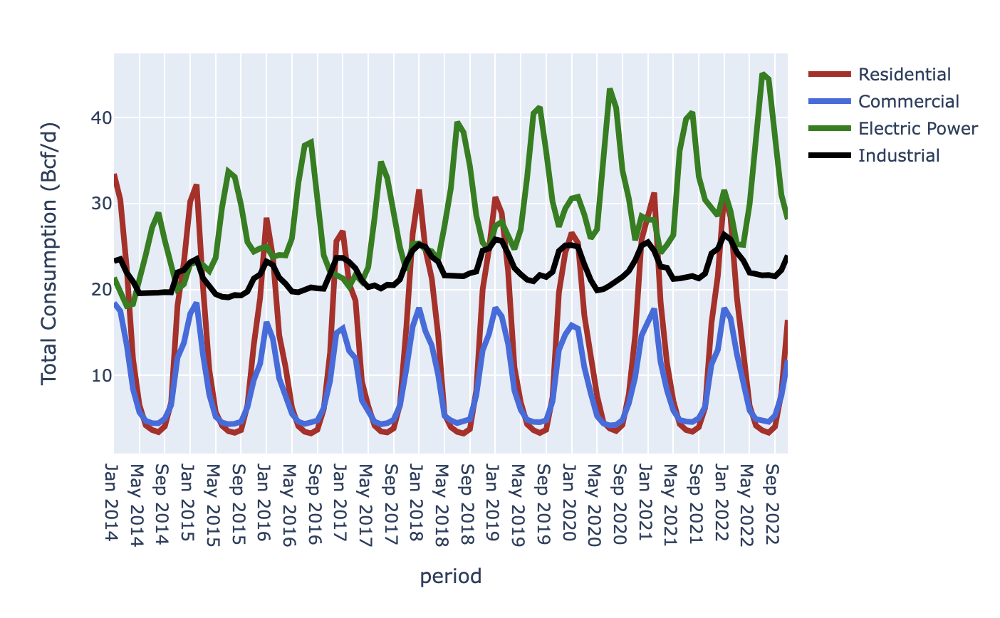

- Real gas consumption (Jan 2014-Nov 2022)
- Note the seasonal peaks
- Electric power has two peaks, one in winter one in summer

<!--
Residential and commercial sectors have a seasonal peak in winter season due to higher demand for heating where natural gas is directly used in furnaces, heat pumps, radiators and other electric equipments.

Industrial sector has a small peak in winter season reflecting some heating related industrial applications.

Electric Power sector has two seasonal peaks due to weather fluctuations Winter peak due to more demand for heating. Summer peak due to more demand for air conditioning.
-->

---

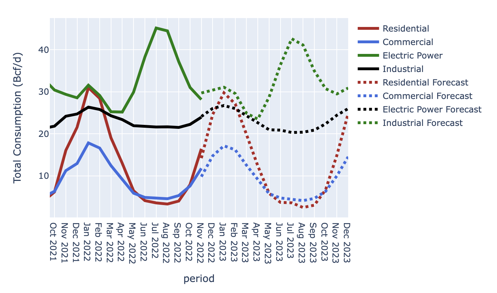

Gas Consumption Forecast by Sector

- (Oct 2021-Dec 2024)
- Auto-regression model from the `statsmodels` package
- [Link to the live plotly plot](https://lukewood.github.io/eia-py/dashboard/natural_gas_consumption_forecast_by_sector.html)

<!--
Residential and commercial sectors have a seasonal peak in winter season due to higher demand for heating where natural gas is directly used in furnaces, heat pumps, radiators and other electric equipments.

Industrial sector has a small peak in winter season reflecting some heating related industrial applications.

Electric Power sector has two seasonal peaks due to weather fluctuations Winter peak due to more demand for heating. Summer peak due to more demand for air conditioning.
-->

---

# Other Topics

- forecast of the real time organization (RTO) demand data
- covariance analysis

---

# Thanks!


Any questions?
